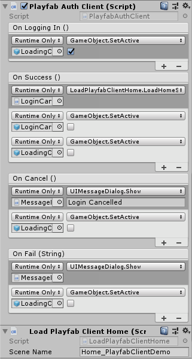
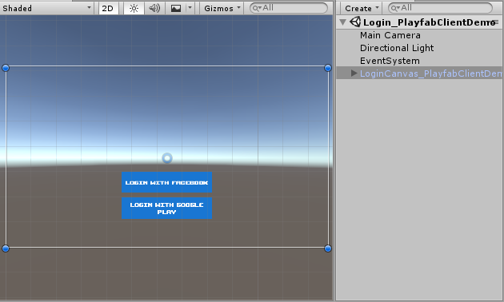
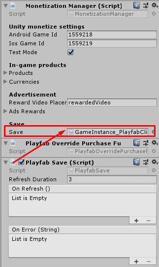
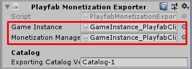
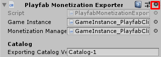
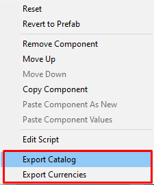

# dot-io-playfab-client
The Playfab client side implementation for an IO-games (Battle IO, Bomber IO and Shooter IO)

## Prerequisite
- [Playfab SDK for Unity](https://api.playfab.com/sdks/unity)
- [Facebook SDK for Unity](https://developers.facebook.com/docs/unity/downloads)
- [Play game services plugin for Unity](https://github.com/playgameservices/play-games-plugin-for-unity/tree/android-java-client/current-build)

## Done
- Export currencies to Playfab
- Export selling items to Playfab
- Login with Facebook
- Login with Google Play
- Save currencies
- Save items
- Save scores to Playfab
- Purchasing items with virtual currencies
- Purchasing items with real money

## Limitation
- Cannot use Requisite price option for an in-game items
- Play game services work with Android only

## How to use
### Login scene
You may create **Login scene** separately from **Home scene** then 
- Add **PlayfabAuthClient** component to manage login events
- Add buttons that has **On Click** event to call login from **PlayfabAuthClient** component
- And in **PlayfabAuthClient** component add **On Success** event to load **Home scene** when loggin success

So in **Login scene** can have just a game object with attached **PlayfabAuthClient** component and login buttons 

### Home scene → Game Instance
To make it use Playfab to save player data you have to attaches following components:
- Attach **PlayfabOverridePurchaseFunctions** component to the same game object with **MonetizationManager** to make it override In-App Purchasing function to validate purchasing at Playfab and also claim items at Playfab
- Attach **PlayfabSave** any game object and set it to **MonetizationManager** → **Save** field to make it save/load player data from Playfab

### Catalog/Currencies exporter
You can export catalog from the game project and import by Playfab easily by
- Attach **PlayfabMonetizationExporter** to any game object then set **GameInstance** and **MonetizationManager** to its fields

- Click on gear icon then select menu to export catalog or currencies

- Import data in Playfab dashboard

